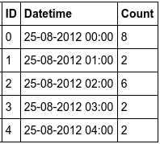
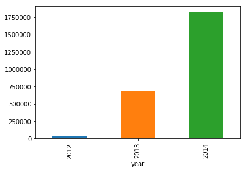
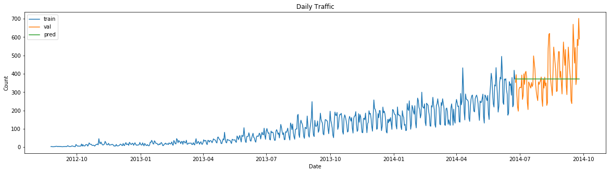
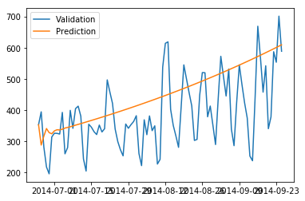
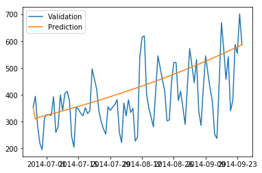
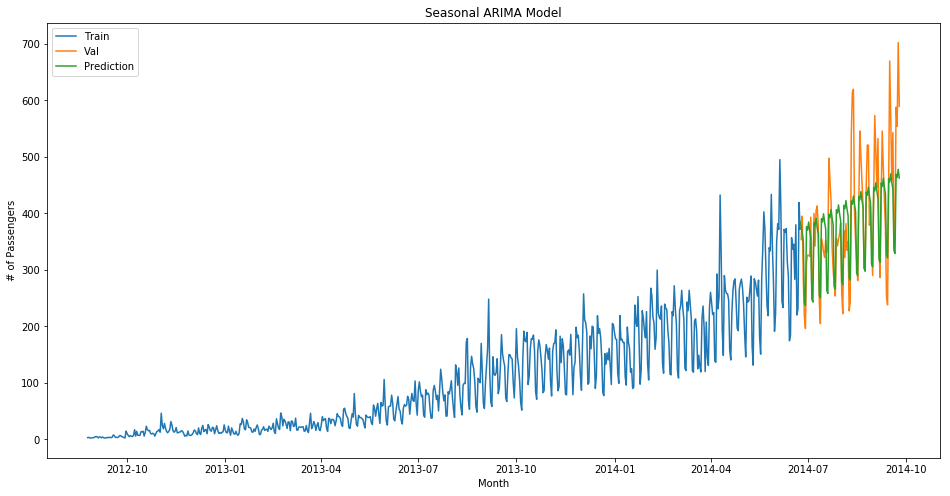
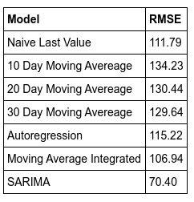

# JetRail Traffic Prediction

JetRail is a fictional railway company that wants to secure funding for its newest project. However it is only worth it if they can serve a million customers in the next 18 months. This problem is part of a competition hosted by the [Analytics Vidya](https://datahack.analyticsvidhya.com/contest/practice-problem-time-series-2/) platform. My solution generated a Root Mean Square error of 166 and ranked a 105 out of almost twenty thousand submissions.
## Data
The dataset was created by Analytics Vidya and consists of 18288 data entries. It has recorded the passenger count every hour from 25 Aug 2012 to 25 Sept 2014. A snapshot of the data is as given below. The contest has a separte test set with values ranging from the 26th of September 2014 to 26th of April 2014.

## Feature Engineering and EDA

Let us formulate certain hypothesis about what trend the data should contain based on general knowledge and check if it holds true.

1. Traffic should increase with time 
    We can get a more accurate idea about this by comparing the means as compared to the sum as the data for some of the years span just a few months. The below graph indicates that the hypothesis holds true.
    

        
    

2. Traffic should vary significantly across months, days, hour of the day and day of the week

| Type of Plot | Plot |
| ----------- | ----------- |
| Monthly  | |
| Daily  | |
| Day of the week | |
| Time of the day | |

3. Compress hourly data to daily

 

## Models
We estimated the trends using various models. The plots for each can be seen below.
<h6>Last Value</h6>

    

<h6>Moving Average</h6>

    

<h6>Auto Regresssion</h6>

    

<h6>Moving Average Integrated</h6>

    

<h6>Seasonal ARIMA</h6>

    

## Conclusion
Naturally the best performing model was the Seasonal ARIMA with a Root Mean Square error of 70 on the test set.

    

